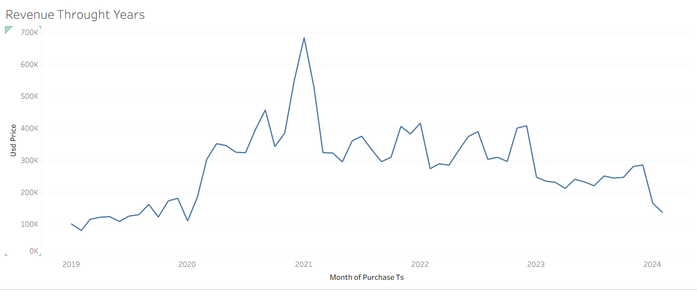

# 📊 ArcadeX Global Sales Analysis Dashboard (2019–2024)

## 1. Background and Overview

**ArcadeX** is a US-based e-commerce company specializing in **gaming essentials** such as monitors, consoles (Nintendo, PlayStation), headsets, and gaming laptops, serving customers **globally**.

This data analysis project examines **ArcadeX’s global sales performance from 2019 to 2024**, with a focus on:

* Revenue trends over time
* Marketing channel effectiveness
* Regional performance patterns
* Product-level revenue contribution

The objective is to uncover **key business drivers**, identify causes behind revenue fluctuations, and generate **actionable insights** to support data-driven decision-making across **sales, marketing, and finance**.

---

## 2. Data Structure Overview

The analysis is based on **two primary datasets**:

### 📁 Sheet 1: Orders

This sheet captures transactional-level sales data, including:

* Order Date
* Order id
* Product Name 
* Revenue / Purchase Amount
* Marketing Channel (Direct, Email, Affiliate, Social Media, etc.)
* Region Identifier

This dataset is used to analyze **time trends, product performance, and marketing channel impact**.

### 🌍 Sheet 2: Regions / Geotags

This sheet maps geographic identifiers to regions such as:

* Country Code 
* Regions

It enables **region-wise revenue comparison** and geographic performance analysis.

🛠 **Tools Used**

* Tableau (Dashboarding & Visualization)
* Excel (Data cleaning & preprocessing)

---

## 3. Executive Summary

* Revenue **peaked sharply during Jan–Feb 2021**, followed by a **steep decline starting Mar–Jun 2021**, with revenue stabilizing at lower levels through 2024.
* **Direct marketing** was the strongest revenue driver across all years, remaining the **largest contributor even post-decline**.
* **Email, Affiliate, and Social Media channels** experienced a major spike (~**$200K revenue**) in **Jan 2021**, before settling to an average of **$80K–$100K** by 2024.
* **North America (NA)** consistently remained the **top-performing region**, with **Europe (EU)** ranking second before declining sharply after early 2021.
* Product-level analysis shows strong dependence on **Direct channels**, with one notable exception: **Lenovo IdeaPad Gaming 3**, where multiple channels contributed meaningfully.

Overall, the post-2021 slowdown is driven by **reduced purchase volumes, regional contraction (especially EU), and declining effectiveness of non-direct marketing channels**.

---

## 4. Insights Deep Dive

### 📈 Revenue Trends Over Years**

* ArcadeX experienced its **highest revenue in Jan–Feb 2021**, likely driven by:

  * Post-pandemic gaming demand
  * Strong direct and digital marketing performance
* A **sharp decline occurred between Mar–Jun 2021**, after which revenue stabilized at lower levels through 2024.
* Seasonal spikes are visible during **holiday months (Nov–Jan)**, indicating predictable demand cycles.

---

### 📣 Marketing Channel Performance 
                                     

📣 Marketing Channel Legend
🔵 Affiliate
🟠 Direct
🔴 Email
🟢 Social Media
🟩 Unknown

* **Direct Marketing**

  * Top-performing channel throughout the entire period
  * Continues to generate an **average ~$200K revenue**, even in later years
  * **Email, Affiliate & Social Media**

  * Generated a **combined spike of nearly $200K in Jan 2021**
  * Revenue declined post-2021 and stabilized around **$80K–$100K**
  * Channel impact analysis across products shows:

### Marketing Channel Impact**

  * **Direct marketing dominates all products**
  * **Lenovo IdeaPad Gaming 3** stands out, where **multiple channels contributed significantly**, unlike other products

---

### 🌍 Regional Performance

🌍 Region Legend   

🔵 AF – Africa
🟠 AP – Asia-Pacific
🔴 AS – Asia
🟢 EU – Europe
🟩 ME – Middle East
🟡 NA – North America
🟣 OC – Oceania
🌸 SA – South America

* **North America (NA)**:
  * Largest and most consistent revenue contributor
  * Dominates sales across key products

 * **Europe (EU)**:
  * Second-largest contributor until early 2021
  * Experienced a sharp decline starting Jan 2021

###  Region Impact**

 * Product–region analysis reveals:
  * **27" 4K Monitor, Nintendo Switch, Sony PlayStation** perform strongly in **NA & EU**
  * **Lenovo IdeaPad Gaming 3 revenue is generated almost exclusively in NA**
  * After **Nov 2021**, other regions show **near-zero contribution** for Lenovo, signaling a potential regional risk

---

### 🕹 Product Performance Highlights

Top-selling products overall:

* 27" 4K Monitor
* Sony PlayStation
* Nintendo Switch
* Lenovo IdeaPad Gaming 3

Revenue decline post-2021 closely aligns with **reduced sales volume of these core products**, rather than complete portfolio shifts.

---

## 5. Recommendations

### 💰 Finance

* Focus investment on **top-performing products** (27" 4K Monitor, PS5 Bundle, Nintendo Switch, Lenovo IdeaPad Gaming 3) to accelerate revenue recovery.
* Apply **seasonality-based forecasting**, leveraging consistent demand peaks in **Nov–Jan**.

### 🛒 Sales

* Develop **region-specific strategies**:
  * Replicate **North America’s successful sales model**
  * Rebuild demand in **Europe and APAC**, where declines were steepest
* Address **Lenovo IdeaPad’s regional dependency** by expanding distribution beyond NA.

### 📢 Marketing

* Maintain **Direct marketing as the core channel**, given its consistent dominance.
* Optimize **Email, Affiliate, and Social Media campaigns** for seasonal pushes rather than year-round spend.
* Introduce **bundling, loyalty programs, and retargeting** to revive declining channels.
* Align underperforming product campaigns with **high-demand seasonal periods**.

---

## 🧠 Final Insight

ArcadeX’s revenue contraction post-2021 is primarily driven by **declining purchase volumes, reduced regional diversification, and weakening non-direct marketing channels**.
A data-backed focus on **core products, regional expansion, and optimized channel strategy** presents the strongest opportunity for sustainable global revenue growth.

---

## 👩‍💻 Author

**Srushti Sinalkar**
Data Analytics & Business Intelligence Enthusiast

---

---

---

